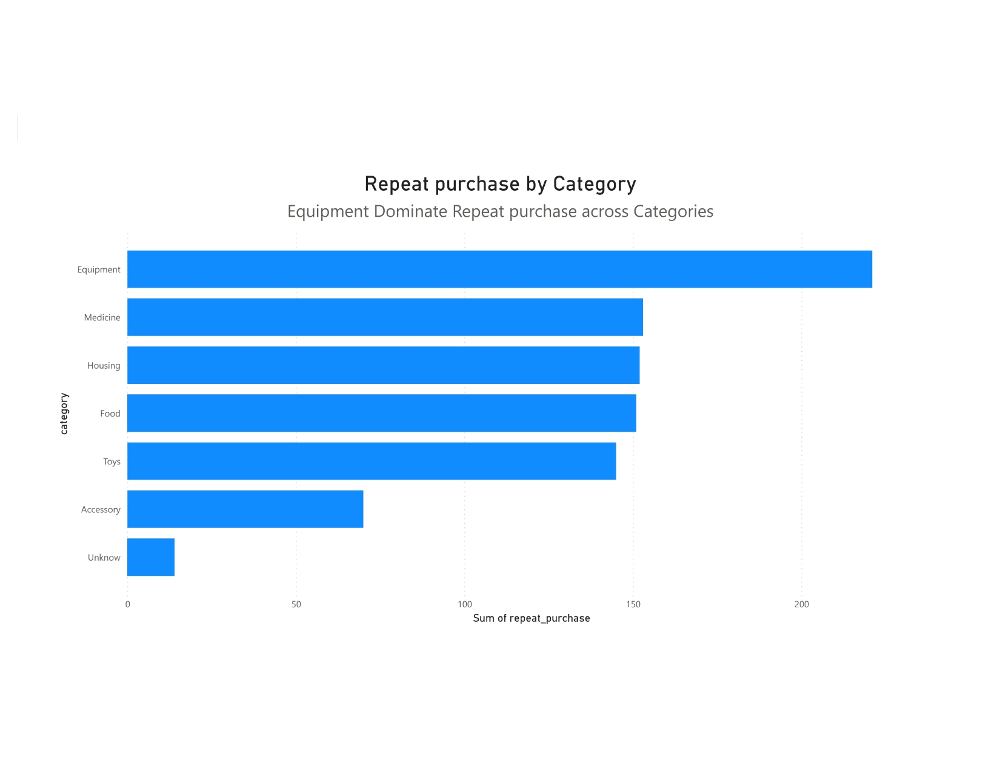
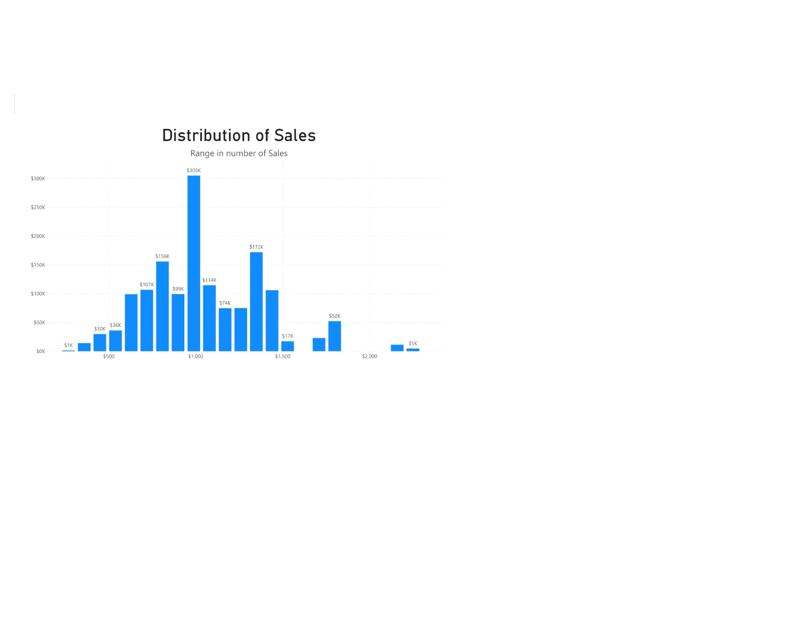
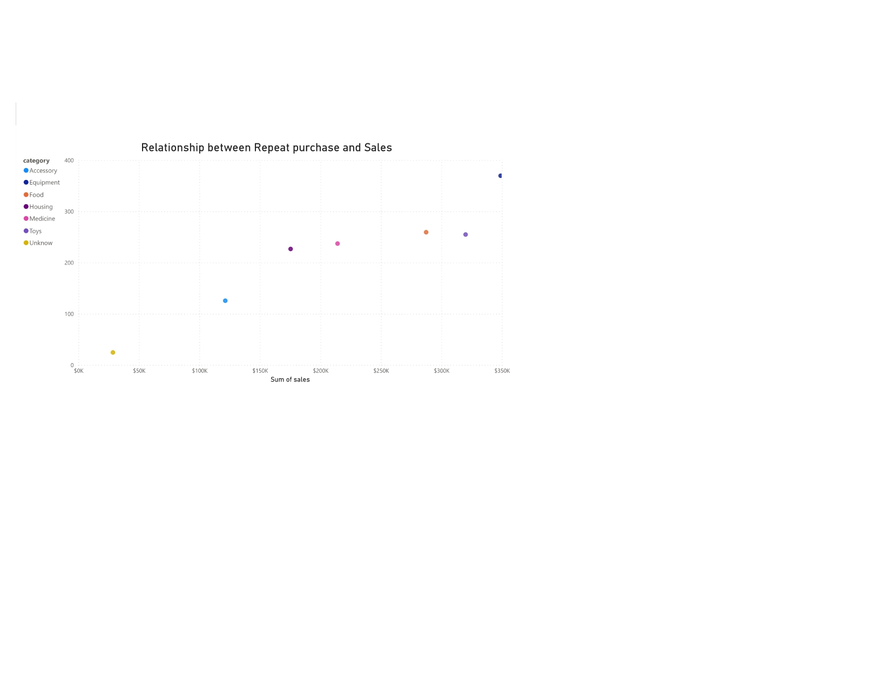

# XYZ-Luxury-Company-Sales-Analysis-Project-

## Introduction 

This is a Power BI project for the Sales Analysis of **XYZ Luxury Company**, an American-based company specializing in luxury toys. The objective of this initiative is to analyze the company's sales data and extract insights to address crucial questions, thereby assisting **XYZ Luxury Company** in making data-driven decisions.

## Data Source 

The dataset was gotten from Datacamp for my certification practical exam and it's a CSV file. 

The dataset has 7 columns with 1500 records which consists (ProductID, Category, Animal, Size, Price, Sales, Rating, Repeat_Purchase)

## Data Validation / Data Cleaning

**Product ID:**
- There are 1500 unique values that match the description provided, serving as unique identifiers of the products.
- There were no missing values.
- No changes were made to this column.

**Category:**
- There are 6 unique values that match the given description.
- There are 25 occurrences of the dash symbol ('-') in the 'category' column, which were considered as missing values.
- The missing values were replaced with "unknown" as per the data description.

**Animal:**
- There are 4 unique values that match the description given. .
- There were no missing values.
- No changes were made to this column.

**Size:**
- There are 3 unique values that match the description given.
- There were no missing values.
- No changes were made to this column.

**Price:**
- The values in the 'price' column match the description given, with positive values rounded to two decimal places. However, the unique values in the 'price' column include both whole numbers and decimal numbers.
- The 'price' column contains a range of positive values, rounded to two decimal places and prices with one decimal place (e.g., 28.1) and whole numbers (e.g, 28), were rounded to two decimal places to maintain consistency in the dataset.
- There are 150 missing values in the 'price' column, denoted as "unlisted."
- The missing values were replaced with the overall median price which was 28.07 as per the data description.
   
**Sales:**
- The values in the 'price' column match the description, with positive values rounded to two decimal places. However, the unique values in the 'sales' column include both whole numbers and decimal numbers.
- The 'sales' column contains a range of positive values, rounded to two decimal places and sales with one decimal place (e.g., 479.2) and whole numbers (e.g, 1046), were rounded to two decimal places to maintain consistency in the dataset.
- There were no missing values.

**Rating:**
- The values in the 'rating' column do not entirely match the description provided, which specified a range from 1 to 10.
- The rating column values ranging from 1 to 9, representing customer ratings.
- There are 150 missing values (null).
- The null values were replaced with 0 as per the data description.

**Repeat Purchase:**
- The 'repeat_purchase' column contains values of 0 and 1, indicating whether customers repeatedly buy the product (1) or not (0)., which is consistent with the given description.
- There are no missing values.
- No changes were made to this column.

## Problem Statement 
1.  Which product category has the highest number of observations for repeat purchases?
2.  What does the distribution of sales look like?
3.  What is the relationship between repeat purchases and sales?
   
## Skills Demostracted 

The following Power BI were Incorporated 
- Data cleaning
- Power query
- Dax
- Page Navigation
- Slicer

## Visualization

1. The product category with the highest number of observations was displayed using a Stacked Bar Chart.
2. The distribution of sales was visualized with a Histogram.
3. The relationship between repeat purchases and sales was visualized with a Scatter Plot.

You can interact with the report here (https://app.powerbi.com/links/EQ2-kfIat2?ctid=c3bb89c4-a632-4554-8a9a-ee5285294755&pbi_source=linkShare)

## Analysis 

Based on my analysis, the **Equipment** category has the most observations in terms of repeat purchases, with a total of 221 repeat purchases. Therefore, among the product categories, **Equipment** has the highest number of repeat purchases.
 
  **Analysis of Balance Across Categories of the Variable "Repeat Purchases":**

I conducted an analysis to examine whether the observations are balanced across various product categories in terms of "repeat purchases." The results indicate the following distribution of repeat purchases among the categories:

 Equipment: This category has the highest number of repeat purchases, with a total of 221 observations.

 Medicine: The Medicine category recorded 153 observations of repeat purchases.

 Housing: Housing products have 152 observations of repeat purchases.

 Food: The Food category shows 151 observations of repeat purchases.

 Toy: The Toy category has 145 observations of repeat purchases.

 Accessory: Accessory products account for 70 observations of repeat purchases.

  Unknown: In the first task, missing values in the "Category" column were replaced with 'unknown,' and these entries contribute 14 observations to the category of "Unknown.

  

**The Distribution of Sale**

The distribution of sales shows that the majority of products have sales values in the lower to middle range, with a concentration around 900 to 1,000 dollars sales.
However, there are a few products with exceptionally high sales values, which contribute to the right skew and indicate that there are some standout performers products.

This distribution provides insights into the variation in sales across different products. So it is important to pay special attention to the products with exceptionally high sales values, which are evident in the right tail of the distribution, in order to make inform decision and strategies related to product management and marketing.

**The Relationship between Repeat Purchase and Sales**

In analyzing the relationship between repeat purchases and sales, i find a weak positive correlation, indicating that as repeat purchases increase, there is a tendency for sales to rise. However, this relationship is characterized by considerable variability. Notably, the "Toy" category stands out with exceptional sales performance relative to repeat purchases, while the "housing" category exhibits slightly lower sales in relation to its repeat purchases. Further exploration is warranted to uncover factors influencing this variability and to identify opportunities for enhancing sales strategies and product offerings.

**Recommendations**

- Implement customer retention strategies in order to encourage and reward repeat customers across all categories. 
- Consider loyalty programs, personalized marketing, and targeted promotions to nurture customer loyalty.
- Establish a system for collecting customer feedback and reviews.
- Actively encourage customers to share their opinions on products and their overall shopping experience.
- Use positive reviews in marketing efforts to build trust, and address any concerns raised to improve overall customer satisfaction.

**Thank You** 🧑‍✈️

